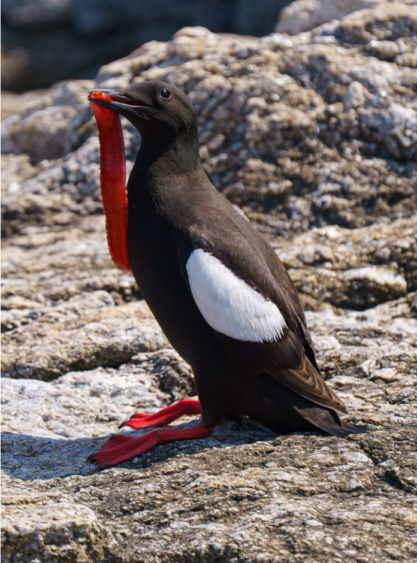

```{r, include = FALSE}
knitr::opts_chunk$set(
  collapse = TRUE,
  comment = "#>",
  fig.path = "man/figures/README-",
  out.width = "100%"
)
```

# shoalsmaRinelab


<!-- badges: start -->
<!-- badges: end -->

The goal of the shoalsmaRinelab package is to provide users with custom palettes developed from photos taken by students, staff, and faculty of landscapes, flora, fauna and cuisine at the Shoals Marine Laboratory. 

A special thank you to Charlotte Tysall for creation of the package logo design, and to the R by the Sea students for inspiring the ideas behind the logo. 

### Installation

You can install the development version of shoalsmaRinelab from [GitHub](https://github.com/) with:

``` r
# install.packages("pak")
pak::pak("faithfrings/shoalsmaRinelab")
```

### How to use `shoalsmaRinelab`

You can get a list of the possible palettes using `sml_palettes_available` function.

```{r}
library(shoalsmaRinelab)
sml_palettes_available()
```

`get_pal` returns the chosen palette as a vector of hex color codes.

```{r}
get_pal("sunset")
```

`print_pal` displays the colour palette.

```{r}
sunset <- get_pal("sunset")
print_pal(sunset)
```

### Examples

Colour palettes can be used for data visualisation in base `R` and `ggplot2`.

#### Continuous example

```{r example}
library(shoalsmaRinelab)
library(ggplot2)

ggplot(faithful,
       aes(x = waiting,
           y = eruptions,
           color = eruptions))+
  geom_point()+
  scale_color_sml(palette = "sunset",
                  discrete = FALSE)+
  theme_bw()
```

#### Discrete example

```{r}
ggplot(mpg, aes(x = class, fill = class)) + 
  geom_bar() + 
  scale_fill_sml(palette = "intertidal_critters",
                 discrete = TRUE) + 
  theme_bw()
```

## Palettes

### Guillemot

<table>
<tr>
<td width="65%" style="vertical-align: middle;">

```{r gilly_pal, echo = FALSE, message=FALSE, warning=FALSE, fig.height=1, fig.width=7}
gip <- get_pal("gilly")
print_pal(gip)
```

</td>
<td width="35%" style="text-align: center; vertical-align: middle;">



</td>
</tr>
</table>

Image: [Marshall Mumford](https://lh3.googleusercontent.com/sitesv/AA5AbUCEhFJmFmLHYVQEUlpqtoZbSee3hftsu8gQEmbyV_oa2cqGs58ch5S6PpazAYbk-k3_QZEWs1oAh-WQK8Fmq1nmFKFlE68-oxWqjneABQMgH2toEvL3Zc00hn05SP4RZSQzzOO3wzeCqza2_WWd7aIG85A0uqw6n2i52_YOSWZSDv_eGifedRhPgXhGgBAb8UCg1hR61VPXLikskmTCIRtd1o7uQqqWZ65AUA=w1280)
