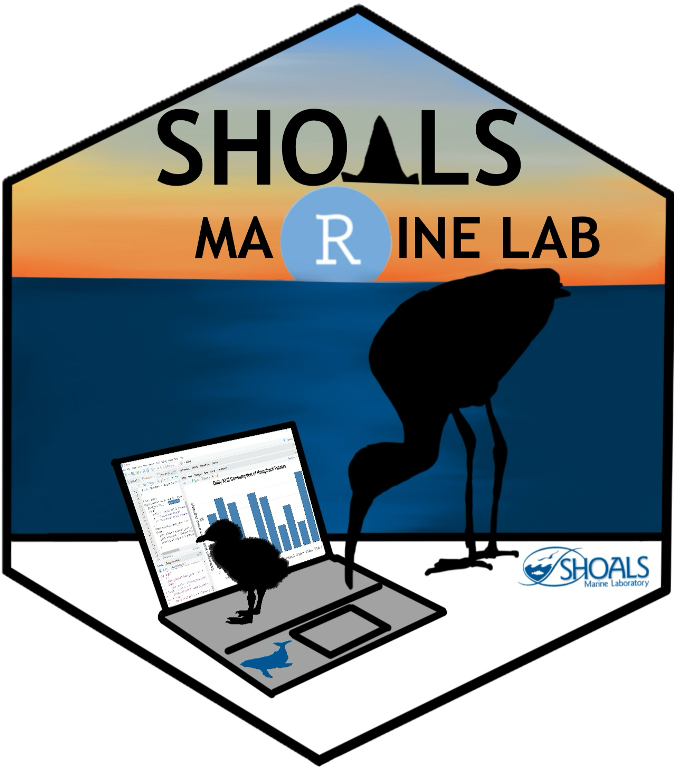
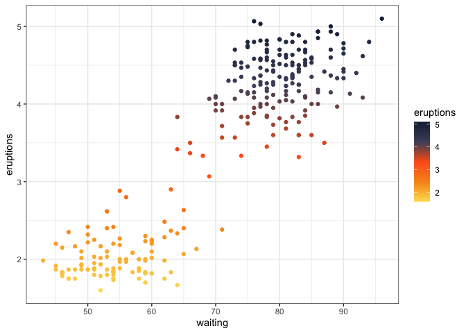
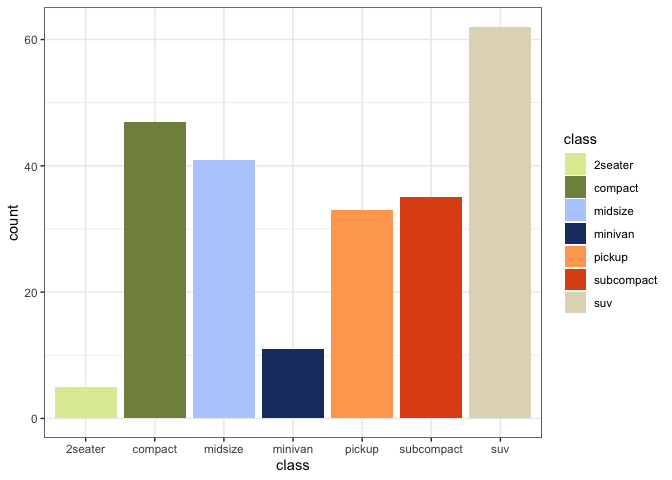

# shoalsmaRinelab



<!-- badges: start -->

<!-- badges: end -->

The goal of the shoalsmaRinelab package is to provide users with custom
palettes developed from photos taken by students, staff, and faculty of
landscapes, flora, fauna and cuisine at the Shoals Marine Laboratory.

A special thank you to Charlotte Tysall for creation of the package logo
design, and to the R by the Sea students for inspiring the ideas behind
the logo.

## Installation

You can install the development version of shoalsmaRinelab from
[GitHub](https://github.com/) with:

``` r
# install.packages("pak")
pak::pak("faithfrings/shoalsmaRinelab")
```

## Examples

You can get a list of the possible palettes using
`sml_palettes_available` function.

### Continuous example

``` r
library(shoalsmaRinelab)
library(ggplot2)
#> Warning: package 'ggplot2' was built under R version 4.4.3

ggplot(faithful,
       aes(x = waiting,
           y = eruptions,
           color = eruptions))+
  geom_point()+
  scale_color_sml(palette = "sunset",
                  discrete = FALSE)+
  theme_bw()
```



### Discrete example

``` r
ggplot(mpg, aes(x = class, fill = class)) + 
  geom_bar() + 
  scale_fill_sml(palette = "intertidal_critters",
                 discrete = TRUE) + 
  theme_bw()
```


